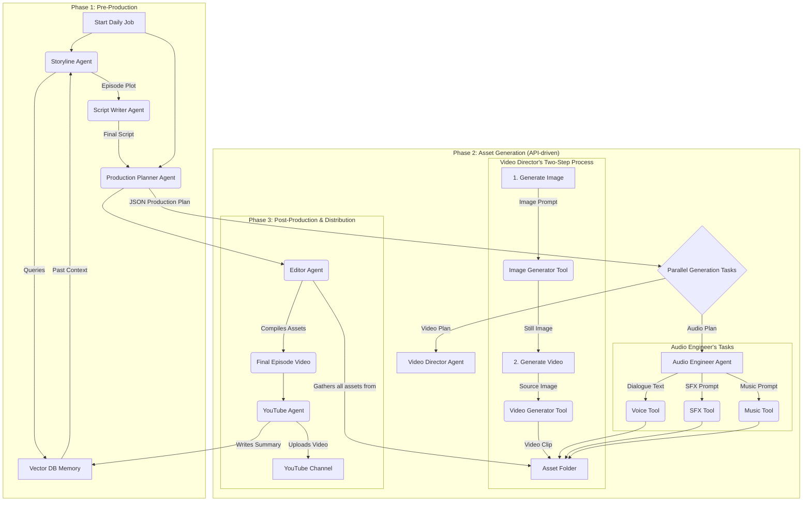

# Multi-Agentic Anime Series Creator


Welcome to the AI Anime Series Creator, a fully autonomous multi-agentic system designed to create, produce, and distribute a new episode of an anime series every single day. This project leverages the power of the `crewAI` framework to orchestrate a team of specialized AI agents, each responsible for a part of the creative pipeline, from writing the story to compiling the final video and uploading it to YouTube.

This system is built using a **free-tier-friendly, API-based architecture**. It uses open-source models for visual and music generation via the Hugging Face and Replicate APIs, ensuring high-quality results without requiring powerful local hardware or expensive initial costs.

## 🌟 Features

- **Autonomous Daily Production**: Designed to be scheduled to run daily, creating a continuous animated series.
- **Multi-Agent System**: Utilizes `crewAI` to manage a "digital studio" of agents for story, planning, visuals, audio, and distribution.
- **Continuous Storyline**: Employs a vector database (`ChromaDB`) to maintain long-term memory, ensuring each new episode logically follows the last.
- **API-Powered Generation**: All heavy computation (video, image, music, SFX) is offloaded to robust, free-tier APIs, making the system lightweight and runnable on standard hardware (like a MacBook).
- **Text-to-Video Workflow**: Implements a sophisticated Image-to-Video pipeline using Stable Video Diffusion for dynamic scenes.
- **Automated Distribution**: A dedicated agent handles the final upload to a specified YouTube channel.

##  workflow

The system operates like a digital production studio, with each agent passing its work to the next in a sequential pipeline.



### 🛠️ The AI Stack

- **Framework**: `crewAI`
- **LLM**: Google `Gemini 1.5 Flash` (for agent reasoning)
- **Image Generation**: `digiplay/AbsoluteReality_v1.8.1` via Hugging Face API
- **Video Generation**: `stabilityai/stable-video-diffusion-img2vid-xt` via Hugging Face API
- **Voice Generation**: Google Cloud Text-to-Speech API
- **SFX Generation**: ElevenLabs SFX API
- **Music Generation**: `facebook/musicgen-small` via Hugging Face API
- **Memory**: `ChromaDB`
- **Video Compilation**: `moviepy`

## ⚙️ Setup Instructions

Follow these steps to get your AI Anime Studio running.

### 1. Clone the Repository
```bash
git clone <your-repo-url>
cd anime_creator
```

### 2. Create a Python Virtual Environment
This is crucial to keep dependencies isolated.
```bash
python3 -m venv venv
source venv/bin/activate  # On Windows: venv\Scripts\activate
```

### 3. Install Dependencies
Install all the required Python libraries from the `requirements.txt` file.
```bash
pip install -r requirements.txt
```

### 4. Set Up API Keys

You will need API keys from a few different services.

1.  **Google Cloud**:
    -   Enable the **"Generative Language API"** and **"Cloud Text-to-Speech API"**.
    -   [Create an API Key](https://console.cloud.google.com/apis/credentials).
2.  **Hugging Face**:
    -   [Create an Access Token](https://huggingface.co/settings/tokens) with "write" permissions.
3.  **ElevenLabs**:
    -   Sign up and get your API Key from your [Profile Settings](https://elevenlabs.io/).

Create a file named `.env` in the root of the project directory and add your keys like this:

```
# .env file
GOOGLE_API_KEY="your_google_cloud_api_key_here"
ELEVEN_LABS_API_KEY="your_elevenlabs_api_key_here"
HUGGING_FACE_API_TOKEN="hf_...your_hugging_face_token_here"
```

### 5. Set Up YouTube API for Uploads

To allow the system to upload videos to your channel, you need to set up OAuth credentials.

1.  Go to the [Google Cloud Console](https://console.cloud.google.com/).
2.  In your project, go to "APIs & Services" and enable the **"YouTube Data API v3"**.
3.  Go to "Credentials", click "+ CREATE CREDENTIALS", and select "OAuth 2.0 Client ID".
4.  Choose "Desktop app" as the application type.
5.  Download the JSON file. **Rename it to `client_secrets.json`** and place it in the root directory of your project.

**Important:** The very first time you run the script, it will open a browser window and ask you to log in with your Google account and grant permission. After you approve, it will create a `token.json` file. This token will be used automatically for all future uploads.

## 🚀 How to Run

### Daily Episode Production
To kick off the full production pipeline for a single episode, run the main script:
```bash
python main.py
```
**Note:** The first time you run any of the API-based tools, especially the video generator, there might be a delay as the models are loaded on the provider's servers. Subsequent runs are usually faster.

### Creating a New Character
To add a new character to the series "bible" (`config.py`), use the character creation utility:
```bash
python create_new_character.py
```
Follow the prompts, and then manually copy the generated character sheet into the `CHARACTERS` dictionary in your `config.py` file.
##Note:
Some bugs in sfx  and video gen part need to find suitable free/OpenSource text-to-vid model to call via an API. 
## 📁 Project Structure

```
anime_creator/
├── agents/         # Agent class definitions
├── core/           # Core resources (LLM and Tool instances)
├── tasks/          # Task definitions for the agents
├── tools/          # All API and local tools
├── utils/          # Helper utilities (memory, file handling)
├── .env            # Your secret API keys
├── config.py       # The "Series Bible" - static story/character data
├── main.py         # Main script for daily production
├── create_new_character.py # Utility for adding new characters
├── requirements.txt # Project dependencies
└── README.md       # This file
```

